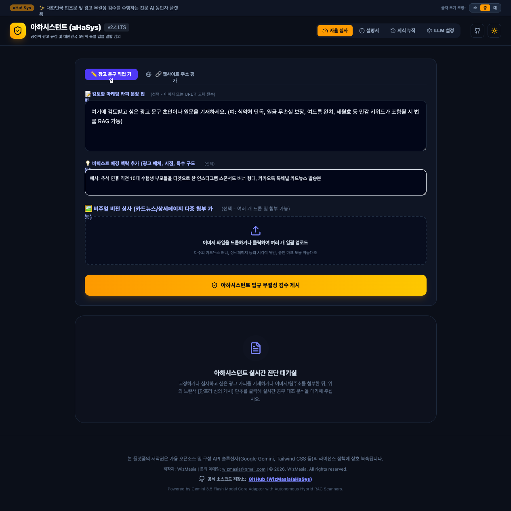

# 🛡️ 아하시스턴트 AI Compliance Review Platform Suite (aHaSys)

> **대한민국 다각적 법률 및 광고 관련 규정 결합 실시간 초엄격 준법 심의 통제 플랫폼**

[](https://opensource.org/licenses/Apache-2.0)
[](https://www.typescriptlang.org/)
[](https://react.dev/)
[](https://tailwindcss.com/)
[](https://ahasys.onrender.com)

🚀 **공식 라이브 데모 웹사이트**: [https://ahasys.onrender.com](https://ahasys.onrender.com)



**아하시스턴트(aHaSys)**는 대외 공개 예정인 기업 마케팅 문안, 상품 설명서 및 웹사이트 등 다양한 매체 자료가 대한민국 광고 관계 법령 및 표시광고 규정 고시를 위반하는지 실시간 분석·진단하는 법적 통제 솔루션입니다. 

기존의 단순 규정 대조를 넘어, 마케터가 간과하기 쉬운 우회적/간접적 리스크까지 전면 스크리닝하는 **'초엄격 감수(Zero-Tolerance) 통제 파이프라인'**이 내장되어 있습니다.

---

## ✨ 핵심 기능 (Key Features)

1. **실시간 광고 규제 위반 초엄격 심사 (Real-time Compliance Audit)**
   * 입력된 텍스트 및 홍보 목적 웹사이트 URL을 정밀 진단하여 잠재적 기만·허위·과장 광고 소지 차단.
   * 이미지 업로드를 통해 시각 도구 비율 왜곡, 사설 인증 마크 오용 및 브랜드 도용 등의 비주얼 위해 요소 진단.

2. **지능형 다중 LLM 결합 어댑터 (Multi-Engine Adapter System)**
   * **Gemini Engine**: Google AI Studio 기반 고성능 클라우드 추론엔진 (공유 키 대기 또는 사용자 개인 키 우회 연결 지향).
   * **Local Engine**: 완전히 격리된 오프라인 프라이버시 검수를 위한 **Ollama** 및 **LM Studio** 원클릭 하이퍼링크 대입 기능 지원.
   * **Other Engine**: **OpenAI API(GPT-4o)**, **OpenRouter** 등 글로벌 상용 LLM 프록시 다이렉트 매핑.

3. **하이브리드 RAG 지식 매핑 및 단어 스캐너**
   * 최신 공정위 법령 고시, 판례 가치 척도 데이터베이스 기반 검색 매핑 및 실시간 가중치 분석 연계.

4. **A4 공무 규정 표준 결과보고서 및 프린트 전용 엔진**
   * 실시간 A4 스케일의 공식 준법 보고서 자동 생성, 아이프레임 제한이 없는 완벽한 **PDF 인쇄 및 즉시 저장 인터페이스** 내장.

5. **개인 정보 유출 방지 및 세션 영구 보존**
   * 기재된 맞춤형 LLM 설정 및 분석 관련 메타 크레덴셜은 사용자의 브라우저 로컬 저장공간(localStorage)에 안전하게 귀속 보관 처리되어 유실되지 않습니다.

---

## 🛠️ 기술 스택 (Tech Stack)

* **Frontend**: React 18, Vite, TypeScript, Tailwind CSS (v4), Motion (Framer Motion), Lucide Icons
* **Backend**: Express (Custom Node Server), Node.js, `tsx` CLI runner
* **APIs & RAG Systems**: Gemini API SDK (`@google/genai`), Hybrid Lexical Correlation Mapper

---

## 🚀 로컬 설치 및 구동 방법 (Installation & Getting Started)

본 도구는 클라우드 샌드박스 독립 컨테이너 환경에서 구동되므로, 사용자의 개인 로컬 컴퓨터 컴퓨터 주소(`localhost` / `127.0.0.1`)의 Ollama/LM Studio 등에 다이렉트로 접근하려면 패키지를 다운로드한 후 본인 로컬 컴퓨터 환경에서 직접 수행하시는 것을 강력 권장합니다.

### 1) 사전 필수 요구 사항
* **Node.js**: v18.0.0 이상 설치 권장
* **npm** 또는 **yarn**
* (선택) **Ollama**가 로컬 컴퓨터에 구동 중인 경우 (`ollama run gemma2:9b` 등)

### 2) 소스코드 내려받기 및 종속성 설치
사용자 화면의 우측 상단 `[Export ZIP]` 메뉴를 눌러 소스 코드를 아카이브 파일 형태로 다운로드하고 압축을 해제합니다. 이후 터미널을 열고 다음 명령문을 수행합니다.

```bash
# 종속성 모듈 다운로드 및 빌드 환경 전개
npm install
```

### 3) 환경 변수 설정
프로젝트 루트 폴더에 `.env` 파일을 생성하고 필요한 API Key 자격 증명을 입력합니다. (예시는 `.env.example` 파일을 참조하십시오.)

```env
# .env 파일 예시
GEMINI_API_KEY=YOUR_GEMINI_API_KEY_HERE
```

### 4) 개발용 전반 로컬 서버 기동
Express 백엔드 기동과 Vite 개발 모듈을 동시에 시작하기 위해 아래 스크립트를 작동시킵니다.

```bash
# 로컬 개발 진영 활성화
npm run dev
```

서버 브라우저 로딩 주소: `http://localhost:3000`

### 5) 상용 빌드 및 실무 배포 (Production Build)
실제 정적 번들 컴파일 및 Standindependent 구동용 공용 서버는 아래 빌드 지시를 통해 실행됩니다.

```bash
# 컴파일 및 esbuild 백엔드 단일 번들화
npm run build

# 프로덕션 상태에서 가동 개시
npm start
```

### 6) Docker를 이용한 간편 로컬 구동 (Alternative)
로컬에 Node.js를 설치하지 않고 Docker 환경을 활용하여 즉시 구동할 수 있습니다.

**단일 컨테이너로 구동 시:**
```bash
# 1. Docker 이미지 빌드
docker build -t ahasys:latest .

# 2. Docker 컨테이너 실행 (Gemini API Key 기입 필수)
docker run -d \
  -p 3000:3000 \
  -e GEMINI_API_KEY="YOUR_GEMINI_API_KEY_HERE" \
  -e NODE_ENV="production" \
  --name ahasys-app \
  ahasys:latest
```

**Docker Compose로 구동 시 (권장):**
루트 폴더에 `.env` 파일을 생성하고 `GEMINI_API_KEY`를 작성한 뒤 다음 명령어로 빌드 및 백그라운드 구동을 실행합니다.
```bash
# 컴포즈 빌드 및 데몬 실행
  docker compose up --build -d
```

실행 완료 후 브라우저에서 `http://localhost:3000`으로 바로 접속할 수 있습니다.

---

## 🏗️ 시스템 아키텍처 및 앱 설계도 (System Architecture Diagram)

aHaSys는 프론트엔드 모듈성 극대화 및 백엔드 다형성 결합을 특징으로 하는 엔터프라이즈 레벨의 정밀 준법 감시 아키텍처로 전면 리팩터링되었습니다.

```text
       [ Client Side (React 19 + TypeScript) ]
┌─────────────────────────────────────────────────────┐
│                   App (Main Layout)                 │
└──────────┬───────────────────────────────┬──────────┘
           │                               │
    [ AppProvider ] Context         [ apiClient ] Layer
┌─────────────────────────────────┐ ┌─────────────────┐
│ - darkMode / fontSize           │ │ - analyze()     │
│ - adapterType / customModel     │ │ - getHistory()  │
│ - localPreset / otherPreset     │ │ - runBenchmark()│
└──────────┬──────────────────────┘ └────────┬────────┘
           │                                 │
           ▼ (Consume State & UI)            ▼ (Consume APIs)
┌─────────────────────────────────────────────────────┐
│ ✏️ ReviewTab    | 📊 BenchmarkTab   | Timeline 저장소 │
│ SettingsTab    | 📜 AboutTab                          │
└─────────────────────────────────────────────────────┘
                                  │
                                  ▼ (HTTP Restful Proxy)
       [ Server Side (Express.js Backend + TSX) ]
┌─────────────────────────────────────────────────────┐
│                   server.ts (Entrypoint)            │
└──────────────────────────┬──────────────────────────┘
                           ▼ (Mount API Router)
┌─────────────────────────────────────────────────────┐
│                 server/routes/api.ts                │
└──────────────────────────┬──────────────────────────┘
                           ▼ (Business Logic)
┌─────────────────────────────────────────────────────┐
│             server/services/llmService.ts           │
└──────┬────────────────────┬────────────────────┬────┘
       │                    │                    │
       ▼ (RAG guidelines)   ▼ (Prompts)          ▼ (Adapter Pattern)
┌──────────────┐    ┌───────────────┐   ┌──────────────────┐
│ regulatory   │    │ compliance    │   │  LLMAdapter      │
│ Library.ts   │    │ Prompt.ts     │   ├──────────────────┤
│ (20k Cases)  │    │ (Rules/Scale) │   │ ├─ GeminiAdapter │
└──────────────┘    └───────────────┘   │ └─ OpenAICompatible│
                                        └──────────────────┘
```

### 1) 클라이언트 사이드 (Frontend Decoupling)
* **단일 책임의 5대 컴포넌트 탭 분리**: 수천 줄의 `App.tsx` 코드를 `ReviewTab`, `SettingsTab`, `BenchmarkTab`, `HistoryTab`, `AboutTab`으로 완전히 기능 격리하였습니다.
* **AppContext API (`AppProvider`)**: `darkMode`, `fontSize`와 같은 테마 구성 및 LLM 환경 설정을 Props Drilling(기존 40여 개 Props 인라인 주입) 없이 독립적인 컨텍스트 전파로 정밀 해소했습니다.
* **apiClient 추상화 레이어 (`src/services/api.ts`)**: 프론트엔드의 모든 직접 fetch 연동 경로를 캡슐화하여 유지보수성을 극대화하였습니다.

### 2) 서버 사이드 (Backend Clean Architecture)
* **다형성 LLM 어댑터 패턴 (Adapter Pattern)**: Gemini API SDK와 커스텀/Ollama 호환 API 어댑터 구조를 `LLMAdapter` 인터페이스 및 구체적 구현 클래스로 구조화하여 신규 AI 엔진 플러그인 연동의 확장성을 극대화하였습니다.
* **RAG 기반 20,000-Case 메가스케일 벤치마크**:
  * 백엔드 구동 시 20,000건의 고유 준법 심의 테스트 케이스를 수식 수학으로 메모리 부하 없이 동적 생산합니다.
  * 회귀 검정 실행 시 전체 20,000건 중 **무작위 100건(RNG 100)**을 추출하여 RAG 판정을 구동합니다.
  * 대용량 분석 결과는 `/api/benchmark/download`를 통해 단일 JSON 팩으로 통째로 다운로드할 수 있습니다.
* **프롬프트 격리**: 거대 한글 시스템 지시문 및 스키마 명세를 `server/prompts/compliancePrompt.ts`로 전면 격리하였습니다.
* **지능형 다중 에이전트 라우팅 및 병렬 파이프라인**: 
  * 중앙 에이전트(Orchestrator)가 1차 스캔하여 검수가 불필요한 영역을 사전에 가지치기합니다.
  * 실정법률(LEGAL)은 상시 작동하며 광고 전문을 검토하고, 사회 논란(SOCIAL), 그린워싱(ESG), 개인정보 보안(PRIVACY), 청소년 위해/사행성(YOUTH) 에이전트는 조건부로 활성화되어 대상 구절(Segment)만 전달받아 검토하므로 처리 속도와 API 토큰 소모량을 대폭 최적화합니다.

---

## 🛡️ 저작권 및 면책 조항 (Copyright & Support Info)

* **제작자 (Author)**: **WizMasia** ([wizmasia@gmail.com](mailto:wizmasia@gmail.com))
* **지적 권리 고지**:
  본 **아하시스턴트 AI Compliance review Platform Suite(aHaSys)** 제품을 구성하는 RAG 법률 조문 매핑 알고리즘 디자인, 연계 벌점 감수 매트릭스 공식 등의 응용 지적 고안은 개발자 WizMasia가 연구 설계 및 개발한 비영리/참고 지적 자산이며, 본 소프트웨어는 사용된 기반 오픈소스 및 API 솔루션사(Google, Tailwind CSS 등)의 라이선스 정책에 상호 종속됩니다.
* **법적 면책 사항**:
  동적 대조에 활용되는 판례 및 법규 데이터베이스 원형은 대한민국 국가법령정보센터(법제처) 공개 API에 법적 기준을 두며, Gemini 및 로컬 Google Gemma 모델 상표권·지적 권리는 Google LLC에 귀속됩니다. 본 시스템은 준법 심의 및 대안 문장 추천에 도움을 주는 참고용 어시스턴트 서비스로서, 실제 사법 기관이나 공정위 심사관의 실질적 유권 해석 및 사법적 소송 결과와 완벽히 100% 대응함을 완전히 보증하지는 않으므로 법적 분쟁 시 조언적 데이터로만 상호 대조하는 것을 권장합니다.
